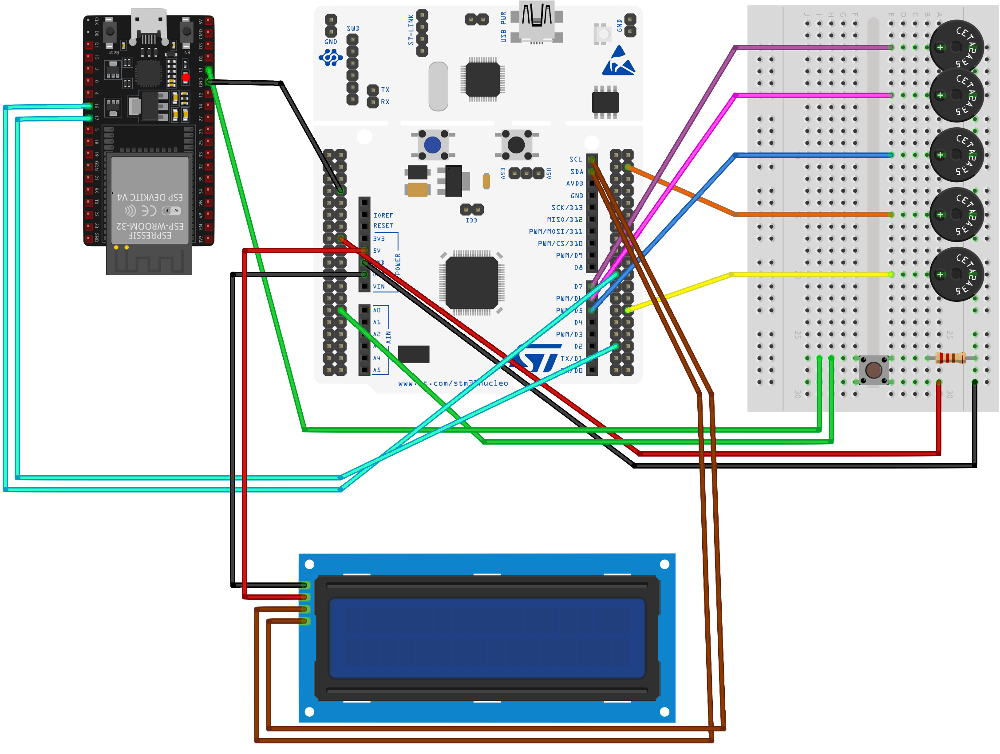

# BellsController-with-ESP32-STMNucleo

### About This Project

This project was developed as part of the "Dispositivi e Circuiti Elettronici" course at the University of Genoa. It was further expanded and refined as part of the final thesis for the Bachelor's degree in "Ingegneria Informatica". The thesis aimed to explore mobile app development and Firebase integration to create a modern and efficient bell event management system.

Here you have the abstract of our thesis:

> The idea for this thesis stems from the observation of the bell-ringing sector, which is not fully aligned with modern technologies. 
Through an analysis of both the Italian and international markets, and with the collaboration of a leading company in the field, we identified a need for innovation to improve the management of bell systems.
Our project offers an advanced and modern alternative for scheduling and automatically executing events and melodies. Through an Android application and a hardware circuit connected to a centralized database, the system provides intuitive and flexible control of the bell systems. The circuit, built with an STM32 Nucleo board and an ESP32 module, uses buzzers to simulate the sound of bells. Users can schedule events through a calendar and create custom melodies, which the system will play at the specified time and date.
This project offers a concrete solution to the modernization needs of the sector, projecting it into the future while maintaining respect for and preserving the bell-ringing tradition.

**Note**: this project should be used with a companion app [BellApp](https://github.com/FN-Org/BellApp)to get all its potential!

## Features
- 🕑 **NTP Time Sync**: Retrieves and synchronizes the current time from an NTP server.
- 🌐 **Firebase Integration**: Stores and retrieves system information from Firebase Firestore and Storage.
- 🖥️ **Display LCD**: Outputs time and event information to an LCD screen.
- 🎶 **Button**: Press the physical button to synchronize your melodies
- 🔊 **Buzzers**: Reproduce your melodies with buzzers simulating bell notes.

## Prerequisites

Before you begin, ensure you have met the following requirements:

- **Hardware**:
  - ESP32 DEVKit Module
  - STM32 Nucleo F446RE
  - Buzzers
  - Display LCD 16x2 with I2C interface
  - Button
  - 220 Ohm resistor
  - Jumpers
  - Breadboard
- **Software**:
  - Arduino IDE with ESP32 support
  - STM32 Cube IDE
- **ESP32 Libraries**: 
  - **[FirebaseClient](https://github.com/mobizt/FirebaseClient)**: Async & sync Firebase Client library for Arduino, made by [Mobizt](https://github.com/mobizt).
  - **[FirebaseJson](https://github.com/mobizt/FirebaseJson)**: The easiest Arduino library JSON parser, builder, and editor, made by [Mobizt](https://github.com/mobizt).
- **STM32 Libraries**:
  -  **[cJSON](https://github.com/DaveGamble/cJSON)**: Ultralightweight JSON parser in ANSI C, made by [Dave Gamble](https://github.com/DaveGamble).
  -  **[FLASH-PROGRAM](https://github.com/controllerstech/STM32/tree/master/FLASH_PROGRAM/F4%20SERIES)**: Write data in the FLASH memory of F4 Series MCU, made by [Controllerstech](https://github.com/controllerstech).
  -  **[STM32_HAL_I2C_HD44780](https://github.com/eziya/STM32_HAL_I2C_HD44780)**: HD44780 I2C Library for STM32, made by [eziya](https://github.com/eziya).

## Circuit diagram

